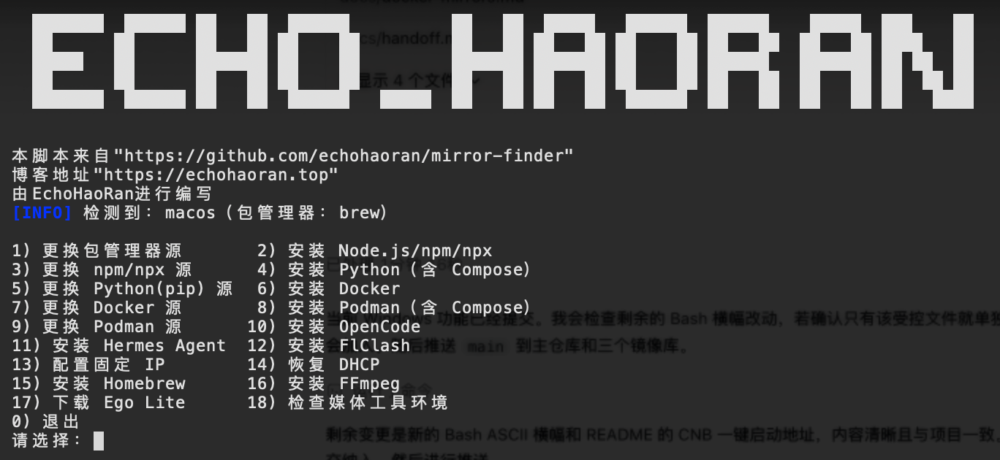

# Mirror Finder

面向 Windows、macOS 与常见 Linux 发行版的交互式环境初始化脚本。它可安装 Git、Node.js、Python、FFmpeg、Docker、Podman、OpenCode、Hermes Agent、FlClash、Pi Agent、Codex CLI 与 Codex 桌面客户端，并可按需配置包管理器、npm、pip、Docker/Podman 镜像与 IPv4 地址。macOS/Linux 使用 Bash 入口；Windows 使用 PowerShell 入口和 Chocolatey，并以 Playwright + Chrome 替代仅支持 macOS 的 Ego Lite。

所有换源功能都会先请求镜像的轻量元数据接口，按实测延迟排序并展示最快的最多 5 个中国大陆镜像。选择镜像后，脚本会再次确认，才会写入配置。

下图展示前 18 项基础菜单；当前脚本另增加第 19–22 项 Pi Agent、Codex CLI、Codex 桌面客户端和 Git：



## macOS 与 Linux

```bash
git clone git@github.com:echohaoran/mirror-finder.git
cd mirror-finder
chmod +x scripts/install.sh
./scripts/install.sh
```

也可以从任一代码托管来源用一条命令直接执行最新版：

GitHub：

```bash
bash -c "$(curl -fsSL https://raw.githubusercontent.com/echohaoran/mirror-finder/main/scripts/install.sh)"
```

Gitee：

```bash
bash -c "$(curl -fsSL https://gitee.com/echohaoran/mirror-finder/raw/main/scripts/install.sh)"
```

CNB：

```bash
bash -c "$(curl -fsSL https://cnb.cool/echohaoran/mirror-finder/-/git/raw/main/scripts/install.sh)"
```

该命令会下载并执行脚本，同时保留终端输入供菜单使用；如需在执行前审阅内容，请使用上方的克隆方式。

也可只执行一项，例如 `./scripts/install.sh 19` 安装 Pi Agent、`20` 安装 Codex CLI、`21` 安装 Codex 桌面客户端、`22` 安装 Git。

支持 macOS（Homebrew）以及 Debian/Ubuntu、Fedora/RHEL/Rocky/AlmaLinux、Arch Linux。WSL 也使用该 Bash 入口。

## Windows

Windows 10/11 请在 PowerShell 5.1 或更高版本中运行独立入口。安装软件、修改 Chocolatey 源和配置网络时需使用管理员 PowerShell：

```powershell
git clone git@github.com:echohaoran/mirror-finder.git
Set-Location mirror-finder
Set-ExecutionPolicy -Scope Process Bypass
.\scripts\install.ps1
```

也可只运行一项，例如 `.\scripts\install.ps1 18` 执行只读环境检查。Windows 菜单与 Bash 入口保持 1–22 编号对应，其中：

- 1、15 使用 Chocolatey，不安装 Homebrew。
- 6 在选定的 WSL 发行版内配置 Docker stable 仓库，完整安装 Engine、CLI、containerd、Buildx 与 Compose；7 备份并写入 WSL 内的 `/etc/docker/daemon.json`。
- 8 在选定的 WSL 发行版内通过其包管理器安装 Podman 与 Compose provider；9 写入 WSL 内的 containers registry 配置。
- 11 使用 Hermes Agent 官方 Windows PowerShell 安装器。
- 12 从 FlClash 官方 GitHub Releases 解析 Windows 安装包。
- 13、14 使用 Windows NetTCPIP cmdlet 配置固定 IPv4 或恢复 DHCP，执行前会确认并备份当前网络信息。
- 17 全局安装 Playwright，并由 Playwright 下载和管理 Chrome；Windows 不安装 Ego Lite。
- 19 从项目固定版本包安装 Pi Agent；20 通过当前 npm 国内镜像安装 Codex CLI。
- 21 优先从 CNB 的 `assets/desktop/` 获取 Codex/ChatGPT 桌面客户端，未命中时回退官方来源。
- 22 安装 Git；macOS/Linux 使用系统包管理器，Windows 使用 Chocolatey。

如果 Windows 尚未安装任何 WSL 发行版，容器菜单会先请求确认，再调用 `wsl --install --distribution Ubuntu`；该步骤可能要求重启并完成 Ubuntu 首次初始化。

Chocolatey 源没有内置未经项目验证的第三方镜像地址：菜单 1 接受用户提供的兼容源 URL，留空则使用官方社区源，并在写入前测试连通性、备份原源列表和请求确认。

## 媒体工具

- 菜单 15 在 macOS 上安装 Homebrew；其他依赖 Homebrew 的安装项也会在缺失时引导安装。
- 菜单 16 安装 FFmpeg，支持项目覆盖的 macOS 与 Linux 包管理器。
- 菜单 17 将 Apple Silicon 版 Ego Lite DMG 下载到 `~/Downloads/egolite.dmg`，不会自动打开或安装应用。
- 菜单 18 只读显示 Homebrew、Node.js、npm、FFmpeg 与 `ego-browser` 的可用状态，不会修改环境。

## 中国大陆资源策略

固定安装资源优先访问 CNB 的 `https://cnb.cool/echohaoran/mirror-finder/-/git/raw/main/assets/`。当前仓库已保存 Homebrew、Docker、OpenCode、Hermes、Chocolatey、Codex CLI 引导脚本及固定版本 Pi Agent 包；来源和 SHA-256 见 [`assets/manifest.json`](assets/manifest.json)。CNB 暂不可用时脚本会提示并回退官方地址；可通过 `MIRROR_FINDER_ASSET_BASE` 改用其他兼容镜像。

npm、pip、系统包、Homebrew bottles、Chocolatey 和容器镜像属于持续更新的完整生态，不复制进 Git，继续使用中国大陆镜像。FlClash、Playwright Chrome 等动态版本资源保留上游解析。Codex 桌面端单包约 365–647 MB，已预留 CNB `assets/desktop/` 路径；未配置 CNB 大文件存储前使用官方回退，详情见 [`assets/README.md`](assets/README.md)。

## 安全说明

- 写入镜像配置前会测速、要求选择并二次确认；系统级配置会备份到 `~/.mirror-finder/backups/`。
- Docker、OpenCode 与 Hermes Agent 的官方安装脚本会先下载到临时文件再执行。
- Linux/WSL 的 Docker 不使用仅推荐测试和开发环境的 convenience script；项目安装器按 stable 软件仓库安装完整组件，后续可由系统包管理器统一升级。安装前会明确确认移除冲突的 Docker/containerd 软件包。
- macOS 的 Docker Desktop 只作为本机开发环境；需要长期运行生产工作负载时应使用 Docker 官方支持的 Linux 主机。
- Docker 镜像由测速结果选择；macOS Docker Desktop 的配置需在其 Settings 页面粘贴，Windows 则写入 WSL 内的 Docker Engine 配置。
- 镜像服务可用性与适用地区会变化；如无法更新，请恢复备份并改用官方源。

Docker 与 Podman 共用同一套 Docker Hub 镜像测速候选池；两者的配置格式不同。规则见 [Docker 镜像候选池](docs/docker-mirrors.md)。

## 固定 IP 与 DHCP

菜单第 13 项会自动找到默认路由网卡，要求输入 IPv4 地址、子网掩码和网关，并识别
macOS 网络服务、NetworkManager、Netplan、systemd-networkd 或传统 ifcfg 配置。写入
前会备份并提示网络可能中断；应用后会重新启用网卡或网络服务。第 14 项会恢复该网卡
的 DHCP。请避免在未设置带外访问的远程 SSH 主机上执行这两项操作。

## 参考

- [Docker 安装文档](https://docs.docker.com/engine/install/)
- [OpenCode 下载](https://dev.opencode.ai/download)
- [Hermes Agent 安装文档](https://hermes-agent.nousresearch.com/docs/)
- [FlClash Releases](https://github.com/chen08209/FlClash/releases)
- [Chocolatey 安装文档](https://docs.chocolatey.org/en-us/choco/setup/)
- [Playwright 浏览器安装文档](https://playwright.dev/docs/browsers)
- [Hermes Agent Windows 安装文档](https://hermes-agent.nousresearch.com/docs/user-guide/windows-native)
- [Pi Agent](https://pi.dev/)
- [Codex CLI](https://learn.chatgpt.com/docs/codex/cli)
- [Codex 桌面客户端](https://learn.chatgpt.com/docs/app)
